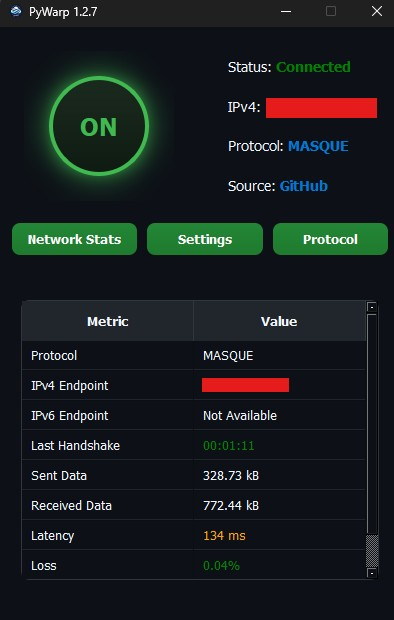
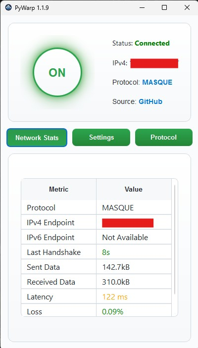

# **Pywarp**

🚀 **Pywarp** is a powerful replacement for the official Cloudflare WARP app, offering more advanced options in an intuitive and feature-rich user interface. With Pywarp, you can configure DNS modes, manage WARP protocols (masque and WireGuard), and set custom endpoints—all designed and all of the current offical app capabalaties to make WARP functionality accessible and convenient.

---

## **Features**
- 🌟 **Enhanced Protocol Support**: Includes UI for changing protocols.
- 🌐 **DNS Mode Management**: Easily toggle between "off," "block adult-content" and "block malware" DNS filters.
- 🔗 **Custom Endpoint Configuration**: Set, save, and reset connection endpoints directly in the app.
- 🛠 **Intuitive UI**: No more command lines! All WARP commands are built into a sleek, user-friendly interface.
- 🎨 **Dynamic Theme Compatibility**: Automatically adapts to your system's dark/light mode.
- 🗂 **Resource Integration**: Bundles settings and assets directly into the app with Qt Resource System for portability.
- ⚡ **Exclude IP/Domain**: Manage exclusions directly from the Advanced Settings.

---

## 🚧 Roadmap

**Completed:**
- ✅ Major Fixes

**Planned / In Progress:**
- 🔁 Add Split Tunnel Future
- 🎨 Rework on Theme
- 🛠 Change Settings Section
- 🔗 Add Proxy Chain

---

## 💖 Support the Project

If you enjoy my work and want to support future development, you can donate here:

👉 [Donate via my official website](https://www.saeedmasoudie.ir/donate.html)

Every contribution helps keep the project alive. Thank you!

---
## **Screenshots**


---

## **Prerequisites**
- Python 3.x installed on your machine.
- Install necessary libraries: pip install -r requirements.txt

---

## **Usage**
- download the app from Releases
- make sure you installed the offical version of WARP (open the app for links)
- close the offical warp (you dont need it anymore)
- enjoy it

---

## **Contributing**
We welcome contributions from the community! To contribute:
1- Fork this repository.
2- Create your feature branch:
```bash
git checkout -b feature/AmazingFeature
```
3- Commit your changes:
```bash
git commit -m "Add some AmazingFeature"
```
4- Push to the branch:
```bash
git push origin feature/AmazingFeature
```
5- Open a pull request.

---

## **License**
This project is licensed under the GNU GPL v3, ensuring all modifications and derivatives remain open-source.

---

## **Acknowledgments**
- Inspired by Cloudflare WARP, with extended features that simplify advanced commands.
- Built with PySide6 for a seamless user experience.
